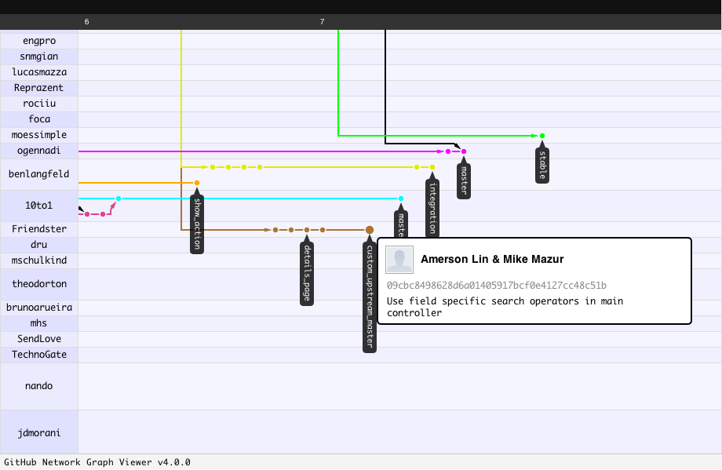

# Be a Good Ruby Citizen

!SLIDE middle

# &#10025; Be a Good Ruby Citizen &#10025;

## Use and contribute code like you give a damn

!SLIDE middle shout

# _Why?_

!SLIDE middle

"We've got to have rules and obey them. 

After all, we're not savages."

!NOTES

Lord of the Flies reference. 

!SLIDE

# Dr Nic's 8 Steps

1. Get annoyed by a defect or missing feature
2. Find the source
3. Checkout the source
4. Snoop around
5. Make changes
6. Refresh the code from the repository (svn up)
7. Create the patch
8. Submit patch

<a href="http://drnicwilliams.com/2007/06/01/8-steps-for-fixing-other-peoples-code/" class="notes">http://drnicwilliams.com/2007/06/01/8-steps-for-fixing-other-peoples-code/</a>

!SLIDE middle

# Let's Simplify

!SLIDE

# 5 Steps

1. Get annoyed by a defect or missing feature
2. Find & checkout the source
3. Create a branch & write a failing test
4. Write code to pass your test & commit
5. Publish your code & submit your patch

!SLIDE

# OK, 6 Steps

1. Get annoyed by a defect or missing feature
2. Find & checkout the source
3. Create a branch & write a failing test
4. Write code to pass your test & commit
5. Publish your code & submit your patch
6. **Pray for acceptance...**

!SLIDE middle

# There's more than just mechanics!

!SLIDE middle

# _How do I know where to start!?_

!SLIDE middle

# Own Your Code

!SLIDE middle

# own&#8226;er&#8226;ship: 

## legal right of possession

!SLIDE middle

# If you use it, you own it

!SLIDE middle

# What do owners do?

!SLIDE middle

# Owners will **take responsibility** and **take care** of their possessions

!SLIDE middle

# But first, get familiar

!SLIDE

# READ

* README
* Code
* Tests
* Bug Reports
* TODO notes
* Forums/mailing lists

!SLIDE

# UNDERSTAND

* Goals & direction of the code
* Impact of changes on the community
* How your desires affect these

!SLIDE middle

# Now, you know

## So take responsibility

!SLIDE

# Use your knowledge:

* Identify and report bugs
* Write tests for bugs
* Write code to fix bugs

!SLIDE middle

# _How do I take care?_

!SLIDE middle

# Be a leader

!SLIDE middle

# Don't ask for permission

!SLIDE

## Find commits from other forks. 

* Read other people's code
* Comment on them
* Pull them into your own
* Be a merge point for ideas

!SLIDE

## GitHub network graph is your best friend

!SLIDE middle

# Advocate for mutual benefit

!SLIDE

## Ensure a bright future for your code:

* Discuss bugs with others
* Discuss goals & direction with others
* Teach and **remember the newbies**! 

!SLIDE

# Own Your Code

1. Get Familiar
2. Take Responsibility
3. Take Care
4. Don't ask for permission
5. Advocate for mutual benefit

!SLIDE middle

# Spread the &#10084;

!SLIDE middle

## Use and contribute code like you give a damn

!SLIDE middle

# &#10025; Be a Good Ruby Citizen &#10025;
